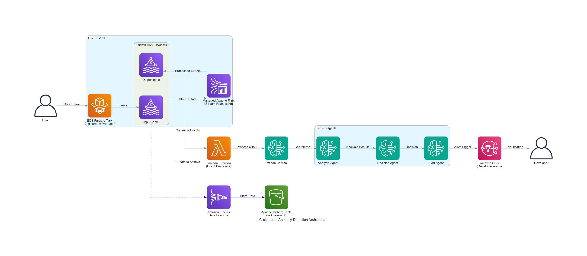

# Agentic AI Enhanced Real-Time Clickstream Anomaly Detection System

## Description

This repository demonstrates an AI-powered real-time clickstream anomaly detection system. The solution combines streaming data processing with intelligent AI agents to detect frontend issues from e-commerce clickstream data and automatically provide AI-generated code fixes and recommendations to developers.

### Key Features

- **Real-time Clickstream Monitoring**: Processes streaming clickstream data from e-commerce frontend applications
- **AI-Powered Decision Making**: Uses Amazon Bedrock agents with Claude Sonnet LLM for intelligent anomaly analysis
- **Frontend Issue Detection**: Identifies race conditions, sequence gaps, and logical violations in user interactions
- **Smart Developer Assistance**: 
  - **Code Generation**: AI-generated fixes for detected frontend issues
  - **Best Practices**: Recommendations for preventing similar issues
- **Intelligent Routing**: Automatically determines issue severity and routes to appropriate developer notification channels
- **Multi-Channel Notifications**: Sends alerts to development teams, DevOps, and product managers via email
- **Scalable Architecture**: Built on AWS serverless technologies (AWS Lambda,Amazon MSK,Amazon Bedrock,Managed Apache Flink)

## Prerequisites

### AWS Account Setup
1. **Bedrock Model Access**: Enable the following models in your AWS Bedrock console:
   - **Claude 3.7 Sonnet V2** (for anomaly analysis and code generation)
2. **IAM Permissions**: Ensure your AWS user/role has permissions for:
   - Bedrock (agent creation and model invocation)
   - Running the CloudFormation which creates resources in your account including Amazon MSK, and a Managed Apache Flink cluster.

### Development Environment (for manual setup only)
- Python 3.11+
- AWS CDK v2
- Docker (for CDK lambda layer building)
- Java 11+ (for Flink application)

## Installation

### Provision AWS resources

This solution is designed for **IaC deployment** using AWS CloudFormation. The CloudFormation template automatically handles most of the infrastructure provisioning and CDK deployment.

1. **Deploy the CloudFormation template**:
   - Navigate to the AWS CloudFormation console in your AWS account
   - Create a new stack using the template: `cfn/anomaly_cfn.yaml`
   - The template will automatically:
     - Create Amazon MSK Serverless cluster with required networking (VPC, subnets, security groups)
     - Set up CodeCommit repository with project source code
     - Launch CodeBuild project that deploys all AWS Lambda functions, SNS Topics, and their integration
     - Configure Flink applications for real-time stream processing

2. **Monitor deployment progress**:
   - CloudFormation stack creation takes ~15-20 minutes
   - CodeBuild automatically runs CDK deployment as part of the stack creation
   - All resources are provisioned and configured automatically

### Manual CDK Development Setup (Optional)

For development purposes only.

```bash
# Clone repository
git clone <repository-url>
cd <repository-dir>

# Install dependencies
pip install -r requirements.txt

# Build CDK Project locally
cdk synth
```

## Usage

### Architecture Overview



The system follows a real-time streaming architecture with AI-enhanced decision making:

1. **Data Ingestion**: Clickstream data flows into MSK topic `data-ingest`
2. **Stream Processing**: Flink application processes data and detects anomalies, outputting results to `data-output` topic
3. **AI Analysis**: AWS Lambda function invokes Bedrock agent to analyze clickstream anomalies
4. **Intelligent Routing**: Agent routes to appropriate action group based on anomaly type:
   - Race condition anomalies → Code finding workflow
   - Sequence gap issues → Frontend debugging workflow
   - Performance anomalies → Optimization recommendations
5. **Developer Notifications**: SNS topics deliver code fixes and recommendations to development teams

#### Key Components:

- **MSK Serverless**: Handles high-throughput clickstream data ingestion and processing
- **Managed Apache Flink**: Real-time anomaly detection with configurable windowing
- **Amazon Bedrock**: AI-powered analysis using Claude 3.7 Sonnet for intelligent decision making
- **Lambda Functions**: Event processing and agent orchestration
- **SNS Topics**: Multi-channel encrypted notifications for different stakeholder groups
- **CodeBuild/CodeCommit**: Automated CDK deployment and infrastructure management


## Project Structure

- **`app.py`**: CDK application entry point
- **`code/code_stack.py`**: Main CDK stack with all AWS resources
- **`code/lambdas/`**: Lambda function implementations
  - `invoke_agent/`: Processes MSK events and invokes Bedrock agent
  - `agent_action_group/`: Code generation and developer recommendation workflows
- **`flink-app/`**: Java Flink application for clickstream processing and anomaly detection
- **`cfn/`**: CloudFormation templates for infrastructure
- **`normal-events-producer/`**: Test data generator for clickstream events

## Technical Implementation Details

### 1. CDK Infrastructure (`app.py`)
The main CDK application deploys:
- **AWS Lambda Functions**: Event processing and notification handlers
- **SNS Topics**: Encrypted notification channels for different stakeholder groups
- **Amazon MSK Integration**: Event source mapping for real-time data processing
- **IAM Roles**: Least-privilege access for all components

### 2. Flink Stream Processing (`flink-app/`)
Java-based Flink application that:
- Consumes clickstream data from MSK `data-ingest` topic
- Detects race conditions, sequence gaps, and logical violations
- Applies machine learning algorithms for anomaly detection
- Outputs structured anomaly events to `data-output` topic
- Supports real-time processing with configurable windowing

### 3. AI Agent Workflows (`code/lambdas/`)
**Invoke Agent Lambda**: 
- Triggered by MSK events
- Formats clickstream anomaly data for agent analysis
- Handles Bedrock agent invocation with retry logic

**Agent Action Group**:
- Processes frontend anomalies and generates code fixes
- Creates detailed technical recommendations
- Generates HTML-formatted emails with syntax highlighting
- Provides best practices and prevention strategies
- Notifies development teams with actionable solutions

### 4. Notification Architecture
Encrypted SNS topics with KMS key rotation:
- **Developer Topic**: Code fixes and technical recommendations
- **DevOps Topic**: Infrastructure and performance alerts
- **Product Team Topic**: User experience impact notifications

### 5. Agent Intelligence
The Bedrock agent uses sophisticated analysis logic:
- Analyzes anomaly patterns and severity levels
- Generates context-aware code fixes for detected issues
- Applies software engineering best practices
- Creates detailed technical documentation and recommendations
- Maintains awareness of frontend frameworks and common patterns

## Support

For questions or issues, please contact any of the repository owners.

## Project Status

Active development for hackathon submission. This is a proof-of-concept implementation demonstrating AI-enhanced clickstream monitoring and automated developer assistance capabilities.